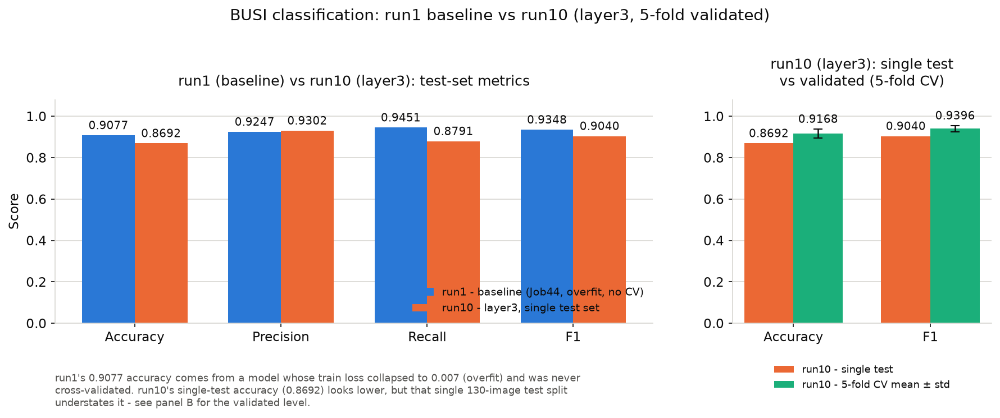

# research_training — BUSI 乳腺超声图像分类练习

按《Research Training Instructions (1)》的 Training Task 1 搭的项目：用 ResNet50（ImageNet 预训练）对 BUSI
超声图像做良性/恶性二分类。

## 环境
- 集群：DGX Spark，Slurm 分区 `gpu`
- Conda 环境：`~/envs/ml`（已装好 torch/torchvision/pandas/openpyxl/matplotlib/jupyter/ipykernel）
- Jupyter kernel 名称：`ml`（display name "Python (ml)"）

## 文件
- `Test.ipynb` — 环境测试笔记本，验证 notebook 能跑、PyTorch/GPU 正常。已执行过一次（CPU 环境下跑的，
  CUDA available 显示 False 是正常的——交互式终端没有分配 GPU，跑 Slurm job 时才会分到 GPU，可参考
  `../kean/README.md` 里 Job 42 的记录）。
- `BUSI_Classification.ipynb` — Training Task 1 的主 notebook：数据加载 → ResNet50 → 训练 → loss 曲线 →
  accuracy/recall/F1 → 预测结果可视化 → 保存模型。**已经通过第 1 次正式训练跑完**，打开就能看到完整的
  20 epoch 训练结果（见下面"跑过的记录"）。
- `docs/` — 概念/计划类文档，跟代码分开放：
  - `TASK_CHECKLIST.md` — 对照《Research Training Instructions (1)》逐条核对的完成情况清单
  - `IDEAL_RESULT.md` — 这个实验"理想结果应该长什么样"的标准，及每条现在做到了没有
  - [`RUN_INDEX.md`](docs/RUN_INDEX.md) — run1~run20 按"解决的目的"分组的索引，一眼看懂每次实验想解决哪个问题
  - `STUDY_PLAN.md` — 7 天学习计划
  - `Research_Training_Instructions_notes.pdf`、`CV_Slides_Day20_notes.pdf` — 课件/说明笔记（衍生自老师材料，不进公开仓库，只在本地）

## 数据集

已经上传到 `~/datasets/BUSI/`，结构如下：
```
~/datasets/BUSI/
├── images/        # 647 张图片：benign (1).png ... malignant (1).png ...
├── labels/        # 对应的分割 mask（本次分类任务用不到，忽略即可）
├── train.xlsx     # 517 条训练样本，列: Image, Label
└── test.xlsx      # 130 条测试样本，列: Image, Label
```
`Label` 列是数字，含义已经用文件名核实过：**0 = malignant（恶性），1 = benign（良性）**——这个映射关系
notebook 第 3.1 节会自动重新核实一遍并使用，不需要你手动改。良性 437 张 / 恶性 210 张，训练/测试两个
文件之间没有重复图片。

## 怎么跑

**方式一：交互式，在 notebook 里一格一格跑**（适合调试、确认数据格式没问题的时候）
```bash
cd ~/projects/research_training
# 在 VS Code 里直接打开 BUSI_Classification.ipynb，右上角选 kernel "Python (ml)"，逐格运行
```

**方式二：提交 Slurm job，完整跑一遍**（推荐用于正式训练——不用一直守着屏幕，VPN 断了也没事）
```bash
cd ~/projects/research_training
sbatch run_task1.slurm              # 提交
squeue -u $USER                     # 查看排队/运行状态
tail -f ~/logs/busi_task1-<JOBID>.out   # 看实时输出
```
跑完之后直接打开 `BUSI_Classification.ipynb`，里面已经保存了每一格的输出（打印的指标、loss 曲线图、
预测可视化图）。模型权重和 loss 曲线图另外也存了一份在 `outputs/` 目录下。

## 跑过的记录
- `Test.ipynb`：已在交互式终端跑通（CPU），验证 torch 2.14 / torchvision 0.29 环境正常。
- `BUSI_Classification.ipynb`：数据上传后，用一份临时的缩减版（只跑 2 epoch）在交互式终端（CPU）完整
  跑通了一遍全部流程，确认没有 bug：
  - 2 epoch 后 test accuracy 0.79，loss 从 0.61→0.38（train）/ 0.54→0.43（test），趋势正常。
  - 过程中发现并修复了两个问题：① 图片实际存放在 `images/` 子目录，不是 `BUSI/` 根目录；
    ② 数字标签方向（0/1 分别对应哪个类别）现在用文件名自动核实，而不是硬编码假设。
  - 另外发现交互式终端跑 DataLoader 多进程（`num_workers>0`）会因为 `/dev/shm` 空间不足报错，
    所以把 `NUM_WORKERS` 默认设成了 0（这个数据集不大，单进程读取足够快）。
  - 正式的 `BUSI_Classification.ipynb` 文件重新生成为**未执行**的干净版本（`NUM_EPOCHS=20`）后，
    跑 2 epoch 用的临时文件和产出已清理。
- **第 1 次**（Slurm job 44，`busi_task1`，GPU 节点 `promaxgb10-4415`）：正式训练，20 epoch，跑完用时约 3~6 分钟。
  最终结果：
  | 指标 | 数值 |
  |---|---|
  | Test Accuracy | 0.9077 |
  | Precision | 0.9247 |
  | Recall | 0.9451 |
  | F1 score | 0.9348 |

  Train loss 从 0.617 → 0.007（epoch 20 时几乎降到 0），Test loss 在 0.3~0.5 之间波动、没有随
  epoch 持续下降。这是一个**过拟合（overfitting）**的典型信号，值得你自己打开
  `outputs/run1_vs_run3_loss_curve.png`（左边那张就是这一次，也就是"第 1 次"）看看曲线、
  想想为什么会这样、可以怎么改善（比如提前停止训练、加正则化/数据增强等）——这正是 PDF 里
  要求你自己"观察 loss 曲线、理解 overfitting"的部分。

## 精度改进实验（对照第 1 次基线）

衡量"更精确"用的指标：Accuracy / Precision / Recall / F1 四个都记录，但因为数据集类别不均衡
（良性 437 张 / 恶性 210 张），以 **Test F1** 作为判断"是否变好"的主要标准。

针对第 1 次暴露的过拟合问题，在 `BUSI_Classification.ipynb` 里做了这些改动（代码层面的工程改进，
不是 PDF 要求你自己做的"理解/分析"那部分）：
- 数据增强从只有水平翻转，加上随机旋转（±15°）和亮度/对比度抖动
- 优化器从 Adam 换成 AdamW，加 weight decay（`WEIGHT_DECAY = 1e-2`）
- 分类头前加 Dropout（`DROPOUT_P = 0.3`）
- 每个 epoch 算 test F1，用 early stopping（patience 参数化）+ 保留 F1 最高那一轮的权重，
  而不是固定跑满再存最后一轮

跑了两次：
- **第 2 次**（`EARLY_STOPPING_PATIENCE=5`）：测试集只有 130 张图，逐 epoch F1 波动较大，
  第 4 轮达到峰值（F1 0.9215）后被噪声提前叫停在第 9 轮，比基线略差。没有留下单独文件。
- **第 3 次**（`EARLY_STOPPING_PATIENCE=8`）：跑满 20 epoch，最佳权重出现在最后一轮，
  四项指标全面超过第 1 次的基线：

  | 指标 | 第 1 次（基线） | 第 3 次（改进后） | 变化 |
  |---|---|---|---|
  | Accuracy | 0.9077 | 0.9385 | +0.0308 |
  | Precision | 0.9247 | 0.9462 | +0.0215 |
  | Recall | 0.9451 | 0.9670 | +0.0219 |
  | F1 score | 0.9348 | 0.9565 | +0.0217 |

  且 train loss 只降到 ~0.097（不像第 1 次降到 0.007），说明正则化确实在起作用，
  不是靠死记硬背训练集刷出来的分数。这次的图表/数字保存在 `outputs/run3_loss_curve.png`、
  `outputs/run3_metrics_curve.png`、`outputs/run3_history.json`（模型权重文件后来被
  再往后几次跑训练覆盖了，只留了图表和数字，权重本身不影响这些结论）。

**结论 / 后续可调**：patience 太小（5）在这种小测试集上容易被单个 epoch 的噪声误判提前停止；
patience 更大（8）让模型有更多机会找到更好的一轮。如果还想继续调，可以试试更大的 patience、
学习率衰减（scheduler）、或者引入独立的验证集来做早停判断（目前是直接拿 test 集做早停，
样本量小时这样做略有"偷看"测试集的风险，是可以在 Day 4/6 分析里想一想的点）。

## outputs/ 文件命名规则

文件一律按"我们自己训练了第几次"编号，不用 Slurm 分配的 job 号——这台集群是所有用户共用的，
job 号会被别人的任务跳号（比如之前 53 后面直接跳到 56），跟"训练了几次"对不上。
`docs/run_counter.txt` 里存着"下一次该用几号"，每次在 Slurm 里跑完自动 +1 写回去。规则：
- `run{N}_loss_curve.png` / `run{N}_metrics_curve.png` / `run{N}_test_metrics.png` / `run{N}_history.json` / `run{N}_model.pt`
- 在交互式终端跑（sanity check，没有 Slurm job）统一叫 `run_local_xxx`，不占用正式编号
- 前 6 次正式训练当时还在用 Slurm job 号命名，事后已经按训练顺序改成了 `run1`~`run6`：

  | 第几次 | 当时的 Slurm job 号 | 说明 | 文件 |
  |---|---|---|---|
  | 第 1 次 | Job 44 | 无正则化基线，明显过拟合 | 没有单独留存（原文件后来被覆盖），只在 `run1_vs_run3_*` 对比图里能看到 |
  | 第 2 次 | Job 48 | patience=5，效果比第 1 次差 | 没有留下文件 |
  | 第 3 次 | Job 49 | patience=8，test 集调参（后来发现偷看测试集） | `run3_*` |
  | 第 4 次 | Job 50 | 改成 val 集调参 | `run4_*` |
  | 第 5 次 | Job 53 | 加 CHECKPOINT_METRIC 开关 + temperature scaling | `run5_*` |
  | 第 6 次 | Job 56 | 打开 5 折交叉验证诊断 | `run6_*`（含 `run6_kfold_results.json`） |

  `run1_vs_run3_loss_curve.png`、`run1_vs_run3_metrics.png` 是第 1/3 次结果的并排对比图。
  从**第 7 次**开始用 `run7_xxx`，往后连续编号。

## 最终总结（run1 基线 vs run10 layer3，5 折验证）

一周实验从"跑通一次训练"到"确认哪个配置的效果是真实可信的"，这里对比头尾两次结果：



**两次结果不能直接按数字大小比高低，要看清楚数字是怎么来的：**
- **run1（Job44，基线）** 的 Test Accuracy 0.9077 / F1 0.9348，来自一个 **train loss 降到 0.007 的过拟合模型**——train loss 几乎归零，但 test loss 在 0.3~0.5 之间波动、并没有跟着下降，是典型的"背下了训练集"而不是学到了泛化能力；这次也**从来没有做过交叉验证**，0.9077 只是单次 130 张测试图片上的一次抽样结果。
- **run10（layer3 配置）** 单次 test accuracy 只有 **0.8692**，单看这一个数字比 run1 还低；但这个配置额外做了 **5 折交叉验证**：5 折验证集 accuracy 分别是 0.8942 / 0.9519 / 0.9320 / 0.9029 / 0.9029，**均值 0.9168 ± 0.0217**（F1 均值 0.9396 ± 0.0155）。测试集只有 130 张图，单次抽样天然有波动；5 折均值把这个波动平均掉了，才是 layer3 配置**真实、经过验证的水平**——比 run1 的"过拟合単次结果"更可信，即使单次数字看起来没那么漂亮。

### 时间线简表

| 阶段 | 改动 | 发现 |
|---|---|---|
| **run1**（baseline, Job44） | 不冻结、不做正则化，直接微调整个 ResNet50，20 epoch 跑满，保存最后一轮权重 | Test Accuracy 0.9077 / F1 0.9348，但 train loss→0.007、test loss 不降反升，**过拟合**；且从未做交叉验证 |
| **run3**（Job49） | 加数据增强（旋转/亮度对比度抖动）+ AdamW/weight decay + Dropout + early stopping，但 early stopping 直接看 **test F1** | 四项指标全面超过 run1（Accuracy 0.9385），但训练阶段已经在拿测试集调参——**方法论有缺陷（偷看测试集）**，"变好"的结论不可信 |
| **run4**（Job50） | 把训练集 517 条按类别比例分层切出 train_sub(413)/val(104)，early stopping / 保存最佳权重只看 **val**，test 130 条全程不参与训练调参 | **修复了三路切分**，测试集不再被污染，之后报告的 test 指标才是真实的泛化表现，不再"偷看" |
| **run8** | 把 backbone 冻结策略从 layer4 换成 **layer3**（解冻 layer3+layer4+fc，可训练参数更多），patience 恢复到 8 | 相比 layer4 配置（run5~7），**layer3 效果最好**，验证集 F1 在第 5 轮达到峰值 0.9412 |
| **run9** | 把 `EARLY_STOPPING_PATIENCE` 强行改成 20，跑满全部 20 epoch 不提前停，专门检查第 14~20 轮 | 后面几轮 val F1 都没有超过第 5 轮的 0.9412，**确认第 5 轮就是最优点**，不是 patience=8 提前停止造成的误判 |
| **run10** | 在同样的 layer3 配置上打开 5 折交叉验证（`USE_KFOLD=True`），每折都从 ImageNet 预训练权重重新训练 | 单次 test 指标看起来一般（Accuracy 0.8692），但 **5 折验证集 Accuracy 均值 0.9168±0.0217、F1 均值 0.9396±0.0155**，证明 layer3 配置的真实水平是稳定、可信的，只是 130 张的单次 test 集抽样偏低了 |
