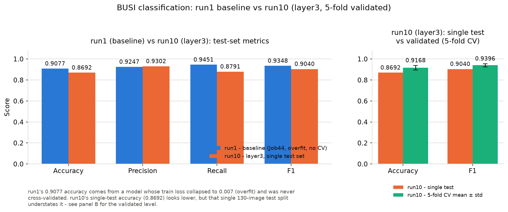

# research_training — BUSI breast ultrasound classification / segmentation exercises

Project built for Training Task 1 of "Research Training Instructions (1)": benign/malignant binary
classification of BUSI ultrasound images with ResNet50 (ImageNet-pretrained). Tasks 2–5 then compared three
classification networks (see `comparison.md`), and Tasks 6–8 ("Research Training Instructions (3)") do tumour
**segmentation** — see the "Training Task 6–8" section at the end and `segmentation_comparison.md`.

## Environment
- Cluster: DGX Spark, Slurm partition `gpu`
- Conda environment: `~/envs/ml` (torch/torchvision/pandas/openpyxl/matplotlib/jupyter/ipykernel installed;
  Tasks 6–8 added `segmentation_models_pytorch`, `nnunetv2`, `medpy`, `statsmodels` — a dry-run confirmed
  beforehand that torch would not be changed)
- Jupyter kernel name: `ml` (display name "Python (ml)")

## Files
- `Test.ipynb` — environment test notebook that checks notebooks run and PyTorch/GPU work. Executed once
  (on CPU — "CUDA available: False" is expected there: the interactive terminal has no GPU, GPUs are only
  allocated to Slurm jobs; see the Job 42 record in `../kean/README.md`).
- `BUSI_Classification.ipynb` — main notebook of Training Task 1: data loading → ResNet50 → training → loss
  curve → accuracy/recall/F1 → prediction visualisation → model saving. **Already executed by the first full
  training run** — open it to see the complete 20-epoch results (see "Runs so far" below).
- `docs/` — concept/planning documents, kept separate from the code:
  - `TASK_CHECKLIST.md` — item-by-item checklist against the instructions
  - `IDEAL_RESULT.md` — what an "ideal result" for this experiment looks like, and which criteria are met
  - [`RUN_INDEX.md`](docs/RUN_INDEX.md) — index of run1–run20 grouped by the problem each run addressed
  - `STUDY_PLAN.md` — 7-day study plan
  - `Research_Training_Instructions_notes.pdf`, `CV_Slides_Day20_notes.pdf` — course/instruction notes
    (derived from the instructor's material, not in the public repo, local only)

## Dataset

Uploaded to `~/datasets/BUSI/`:
```
~/datasets/BUSI/
├── images/        # 647 images: benign (1).png ... malignant (1).png ...
├── labels/        # segmentation masks, same filenames as images/, pixel values 0/1 (unused for classification, used by Tasks 6–8)
├── train.xlsx     # 517 training samples, columns: Image, Label
└── test.xlsx      # 130 test samples, columns: Image, Label
```
`Label` is numeric; its meaning was verified against the filenames: **0 = malignant, 1 = benign**. Section 3.1
of the notebook re-verifies and applies this mapping automatically, nothing to change by hand. 437 benign /
210 malignant images; no image appears in both files.

## How to run

**Option 1: interactively, cell by cell** (for debugging and checking the data format)
```bash
cd ~/projects/research_training
# open BUSI_Classification.ipynb in VS Code, pick kernel "Python (ml)" (top right), run cell by cell
```

**Option 2: submit a Slurm job for a full run** (recommended for real training — no need to watch the
screen, a dropped VPN does not matter)
```bash
cd ~/projects/research_training
sbatch run_task1.slurm              # submit
squeue -u $USER                     # queue / running status
tail -f ~/logs/busi_task1-<JOBID>.out   # live output
```
Afterwards just open `BUSI_Classification.ipynb`: every cell's output (printed metrics, loss curves,
prediction plots) is saved in it. Model weights and loss curves are also saved to `outputs/`.

## Runs so far
- `Test.ipynb`: ran in the interactive terminal (CPU), confirming the torch 2.14 / torchvision 0.29 environment.
- `BUSI_Classification.ipynb`: after uploading the data, a temporary reduced copy (2 epochs only) ran the
  whole pipeline end to end in the interactive terminal (CPU) to confirm there were no bugs:
  - after 2 epochs test accuracy 0.79, loss 0.61→0.38 (train) / 0.54→0.43 (test), a normal trend.
  - two problems were found and fixed: ① the images live in the `images/` subfolder, not the `BUSI/` root;
    ② the direction of the numeric labels (which class 0/1 means) is now verified from the filenames
    instead of hard-coded.
  - multi-process DataLoader (`num_workers>0`) fails in the interactive terminal because `/dev/shm` is too
    small, so `NUM_WORKERS` defaults to 0 (the dataset is small, single-process loading is fast enough).
  - the real `BUSI_Classification.ipynb` was then regenerated as a clean **unexecuted** version
    (`NUM_EPOCHS=20`), and the temporary 2-epoch files and outputs were removed.
- **Run 1** (Slurm job 44, `busi_task1`, GPU node `promaxgb10-4415`): full training, 20 epochs, about 3–6 minutes.
  Final results:
  | Metric | Value |
  |---|---|
  | Test Accuracy | 0.9077 |
  | Precision | 0.9247 |
  | Recall | 0.9451 |
  | F1 score | 0.9348 |

  Train loss went 0.617 → 0.007 (almost 0 at epoch 20) while test loss fluctuated between 0.3 and 0.5
  without decreasing over the epochs. This is a typical **overfitting** signal — worth opening
  `outputs/run1_vs_run3_loss_curve.png` yourself (the left plot is this run, "run 1"), looking at the curves
  and thinking about why it happens and how to improve it (early stopping, regularisation, data
  augmentation, ...). That is exactly the "observe the loss curve, understand overfitting" part the PDF asks
  you to do yourself.

## Accuracy-improvement experiments (against the run 1 baseline)

All four metrics (Accuracy / Precision / Recall / F1) are recorded, but because the classes are imbalanced
(437 benign / 210 malignant), **Test F1** is the main criterion for "better".

To address the overfitting seen in run 1, `BUSI_Classification.ipynb` got these changes (engineering
improvements in the code — not the "understanding/analysis" part the PDF asks you to do yourself):
- data augmentation: horizontal flip plus random rotation (±15°) and brightness/contrast jitter
- optimizer Adam → AdamW with weight decay (`WEIGHT_DECAY = 1e-2`)
- Dropout before the classification head (`DROPOUT_P = 0.3`)
- test F1 computed every epoch, early stopping (configurable patience) and keeping the weights of the
  best-F1 epoch instead of always training to the end and saving the last epoch

Two runs:
- **Run 2** (`EARLY_STOPPING_PATIENCE=5`): with only 130 test images the per-epoch F1 is noisy; it peaked at
  epoch 4 (F1 0.9215) and was stopped by noise at epoch 9, slightly worse than the baseline. No files kept.
- **Run 3** (`EARLY_STOPPING_PATIENCE=8`): ran all 20 epochs, best weights at the last epoch, better than the
  run 1 baseline on all four metrics:

  | Metric | Run 1 (baseline) | Run 3 (improved) | Change |
  |---|---|---|---|
  | Accuracy | 0.9077 | 0.9385 | +0.0308 |
  | Precision | 0.9247 | 0.9462 | +0.0215 |
  | Recall | 0.9451 | 0.9670 | +0.0219 |
  | F1 score | 0.9348 | 0.9565 | +0.0217 |

  Train loss only fell to ~0.097 (not 0.007 as in run 1), so the regularisation is working and the score is
  not from memorising the training set. The plots/numbers are in `outputs/run3_loss_curve.png`,
  `outputs/run3_metrics_curve.png`, `outputs/run3_history.json` (the weight file was overwritten by later
  runs; only plots and numbers remain, which does not affect these conclusions).

**Conclusion / what could be tuned next**: a small patience (5) is easily fooled by single-epoch noise on a
test set this small; a larger patience (8) gives the model more chances to reach a better epoch. Further
options: larger patience, a learning-rate scheduler, or a separate validation set for early stopping
(early stopping currently looks at the test set directly, which risks "peeking" at the test set when the
sample is small — something to think about in the Day 4/6 analysis).

## outputs/ naming rule

Files are numbered by "which training run of ours this is", not by the Slurm job ID — the cluster is shared
by all users, so job IDs skip numbers because of other people's jobs (e.g. 53 was followed directly by 56)
and do not match the number of runs. `docs/run_counter.txt` stores the next number to use and is
incremented automatically after every Slurm run. Rules:
- `run{N}_loss_curve.png` / `run{N}_metrics_curve.png` / `run{N}_test_metrics.png` / `run{N}_history.json` / `run{N}_model.pt`
- runs in the interactive terminal (sanity checks, no Slurm job) are named `run_local_xxx` and do not use a number
- the first 6 runs were originally named after their Slurm job IDs and were later renamed `run1`–`run6` in
  training order:

  | Run | Slurm job ID at the time | Description | Files |
  |---|---|---|---|
  | Run 1 | Job 44 | baseline without regularisation, clearly overfits | not kept separately (original files were overwritten), only visible in the `run1_vs_run3_*` comparison plots |
  | Run 2 | Job 48 | patience=5, worse than run 1 | no files kept |
  | Run 3 | Job 49 | patience=8, tuned on the test set (later found to peek at the test set) | `run3_*` |
  | Run 4 | Job 50 | switched to tuning on the val set | `run4_*` |
  | Run 5 | Job 53 | added the CHECKPOINT_METRIC switch + temperature scaling | `run5_*` |
  | Run 6 | Job 56 | enabled the 5-fold cross-validation diagnostic | `run6_*` (incl. `run6_kfold_results.json`) |

  `run1_vs_run3_loss_curve.png` and `run1_vs_run3_metrics.png` compare runs 1 and 3 side by side.
  From **run 7** on, files are named `run7_xxx` and numbered consecutively.

## Final summary (run1 baseline vs run10 layer3, 5-fold validation)

A week of experiments went from "get one training run working" to "establish which configuration's
performance is real and trustworthy". The first and last results compared:



**The two results cannot be ranked just by the size of the numbers — what matters is where the numbers come from:**
- **run1 (Job44, baseline)**: Test Accuracy 0.9077 / F1 0.9348 come from an **overfitted model whose train
  loss fell to 0.007** — train loss near zero while test loss fluctuates between 0.3 and 0.5 without
  following it, the classic sign of "memorising the training set" rather than learning to generalise. This
  run also **never used cross-validation**; 0.9077 is one sample on 130 test images.
- **run10 (layer3 configuration)**: a single test accuracy of only **0.8692**, lower than run1 on its own;
  but this configuration was also checked with **5-fold cross-validation**: per-fold validation accuracy
  0.8942 / 0.9519 / 0.9320 / 0.9029 / 0.9029, **mean 0.9168 ± 0.0217** (mean F1 0.9396 ± 0.0155). With only
  130 test images a single split naturally fluctuates; the 5-fold mean averages that out and is the
  **real, validated level** of the layer3 configuration — more trustworthy than run1's "overfitted single
  result", even though the single number looks less impressive.

### Timeline

| Stage | Change | Finding |
|---|---|---|
| **run1** (baseline, Job44) | no freezing, no regularisation, fine-tune all of ResNet50 for 20 epochs, save the last epoch | Test Accuracy 0.9077 / F1 0.9348, but train loss→0.007 while test loss does not fall: **overfitting**; never cross-validated |
| **run3** (Job49) | data augmentation (rotation / brightness-contrast jitter) + AdamW/weight decay + Dropout + early stopping, but early stopping looks at **test F1** directly | beats run1 on all four metrics (Accuracy 0.9385), but tunes on the test set during training — **methodological flaw (peeking at the test set)**, so the "improvement" is not trustworthy |
| **run4** (Job50) | stratified split of the 517 training samples into train_sub (413) / val (104); early stopping / best-weight selection only look at **val**; the 130 test samples are never used for tuning | **three-way split fixed**: the test set is no longer contaminated, and test metrics reported from here on reflect real generalisation |
| **run8** | backbone freezing changed from layer4 to **layer3** (layer3 + layer4 + fc trainable, more trainable parameters), patience back to 8 | compared with the layer4 configuration (run5–7), **layer3 works best**; validation F1 peaks at epoch 5 with 0.9412 |
| **run9** | `EARLY_STOPPING_PATIENCE` forced to 20 to train all 20 epochs without stopping, specifically to check epochs 14–20 | no later epoch beats epoch 5's val F1 of 0.9412, **confirming epoch 5 is the optimum** and not an artefact of stopping early with patience=8 |
| **run10** | 5-fold cross-validation (`USE_KFOLD=True`) on the same layer3 configuration, every fold retrained from the ImageNet weights | the single test result looks mediocre (Accuracy 0.8692), but the **5-fold validation mean is Accuracy 0.9168±0.0217, F1 0.9396±0.0155**, showing that the layer3 configuration is stable and trustworthy and the single 130-image test sample just came out low |

## Training Task 6–8: BUSI tumour segmentation (U-Net / nnU-Net / DeepLabV3+)

### Goal
Train three segmentation models on BUSI, output a binary tumour mask for every test image, evaluate with
Dice / IoU / HD95, compare the models' failure types visually, test whether the differences are significant
with paired statistical tests, and write it up in `segmentation_comparison.md`.

### Data
- Images in `~/datasets/BUSI/images/`, masks in `~/datasets/BUSI/labels/`: **identical filenames**
  (`benign (1).png` ↔ `benign (1).png`). Each image has exactly one mask file (no `_mask_1`-style extra
  masks; the code still OR-merges multiple mask files if present), and no mask is empty.
- The split is the fixed `train.xlsx` (517) / `test.xlsx` (130), no random re-splitting and no validation
  split; all three models use their **final-epoch** weights.

### How to run
```bash
cd ~/projects/research_training
# Task 6: the three models can be submitted together (the gpu partition has 2 nodes, the third one queues)
(cd task6_unet && sbatch run_task6_unet.slurm)
(cd task6_nnunet && sbatch run_task6_nnunet.slurm)
(cd task6_deeplabv3plus && sbatch run_task6_deeplabv3plus.slurm)
# after all three have finished, run Task 7 / Task 8 (CPU only, they read the Task 6 outputs)
(cd task7_visual_comparison && sbatch run_task7_visual_comparison.slurm)
(cd task8_statistics && sbatch run_task8_statistics.slurm)
```
Each Slurm script executes its notebook on a compute node with `jupyter nbconvert --execute --inplace`;
afterwards just open the notebook to see the outputs.

### Steps / files
| Folder | Contents |
|---|---|
| `task6_unet/U_Net_segmentation.ipynb` | classic U-Net trained from scratch; weights `outputs/unet_final.pt` |
| `task6_nnunet/nnU_Net_segmentation.ipynb` | nnU-Net v2: conversion to the `Dataset501_BUSI` layout + `dataset.json` → plan & preprocess → custom trainer `nnUNetTrainer_BUSIfair` (100 epochs × 33 iterations, seed 42) → training → prediction; weights in `nnUNet_results/.../fold_all/checkpoint_final.pth` |
| `task6_deeplabv3plus/DeepLabV3Plus_segmentation.ipynb` | DeepLabV3+ with an ImageNet-pretrained ResNet50 encoder; weights `outputs/deeplabv3plus_final.pt` |
| all three folders above | `predictions/*.png` (binary masks at original size, 0/255), `per_image_metrics.csv` (`image_name, dice, iou, hd95`, same image order for all three models); the end of each notebook shows original / ground truth / prediction / overlay for every test image |
| `task7_visual_comparison/visual_comparison.ipynb` | illustration of what the metrics measure; error type per image and model (missed / under-segmentation / over-segmentation / inaccurate boundary); the three models side by side on the same test image, figures in `figures/` |
| `task8_statistics/statistical_analysis.ipynb` | mean ± SD, pairwise paired t-tests + Holm correction, Wilcoxon signed-rank tests + Holm correction, results table `statistical_tests.csv`, and an analysis of why the two tests disagree |

Fair comparison: the shared-hyperparameter block in the configuration cell at the top of the three notebooks is
identical word for word — 256×256 input, grayscale + per-image z-score, seed 42, batch 16, 100 epochs,
Adam 1e-4, Dice+BCE, the same augmentation, the same inference and metric code.
**Documented differences**: DeepLabV3+ uses ImageNet pretraining; nnU-Net keeps its own SGD 1e-2 + poly
learning rate, deep supervision, its own augmentation and the automatically planned network (reasons at the
top of the nnU-Net notebook and in `segmentation_comparison.md`).
**Empty prediction**: Dice = IoU = 0, HD95 = diagonal of the original image (worst case), so the paired tests
do not lose any image.

### Results (130 test images, mean ± SD)
| Model | Dice | IoU | HD95 (px) | Empty predictions |
|---|---|---|---|---|
| U-Net | 0.7301 ± 0.3108 | 0.6491 ± 0.3093 | 104.01 ± 162.88 | 5 |
| nnU-Net | 0.7797 ± 0.2388 | 0.6874 ± 0.2530 | 70.78 ± 114.18 | 1 |
| DeepLabV3+ | **0.7971 ± 0.2594** | **0.7185 ± 0.2642** | **64.31 ± 90.41** | 0 |

- DeepLabV3+ is best on average and significantly better than U-Net on all three metrics under both the
  t-test and the Wilcoxon test (after Holm correction), and significantly better than nnU-Net on IoU.
- U-Net and nnU-Net are tied on a "typical image" (median Dice 0.886 vs 0.890); nnU-Net is significantly
  better in the t-test because U-Net fails completely on more images (Dice < 0.1: 15 vs 4), and the
  difference is not significant with the Wilcoxon test.
- The two tests disagree on 4 of the 9 comparisons; the differences are strongly non-normal, so the Wilcoxon
  conclusions are the more reliable ones.
- Detailed analysis, example figures and limitations: `segmentation_comparison.md`.

### Problems encountered while running
- The first DeepLabV3+ smoke test hung: a multi-process DataLoader (forked workers) deadlocks on these
  aarch64 nodes (smp used multi-threaded CPU ops while loading the weights, and the workers forked
  afterwards got stuck). Both PyTorch notebooks were set to `NUM_WORKERS = 0` (the data is cached in memory
  anyway, so speed is almost unchanged).
- nnU-Net's plan/preprocess took about 18 minutes and the actual training about 17 minutes. The
  `InvalidAccount` reason shown while a job is queued is only how this cluster (accounting disabled) labels
  a waiting job; it starts normally once a node is free.
