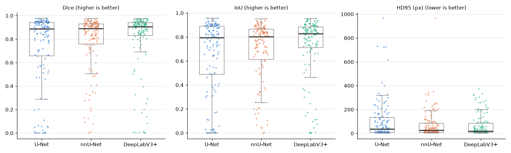
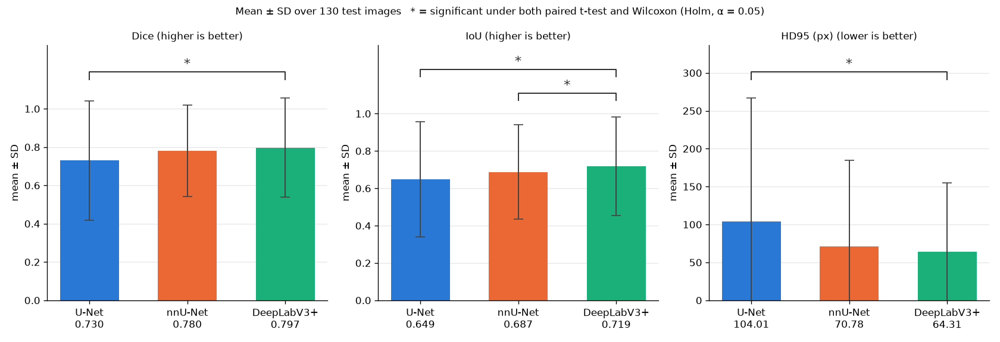
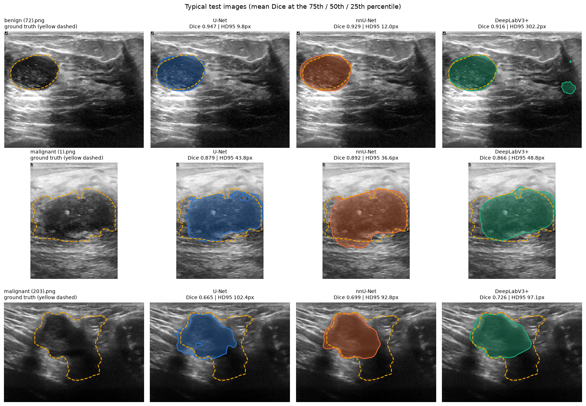
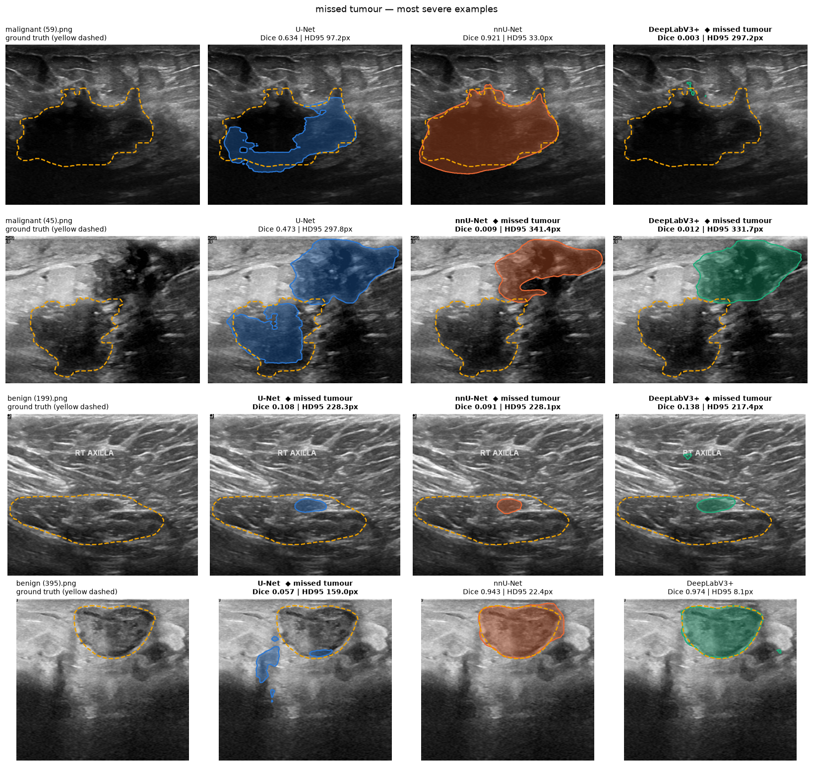
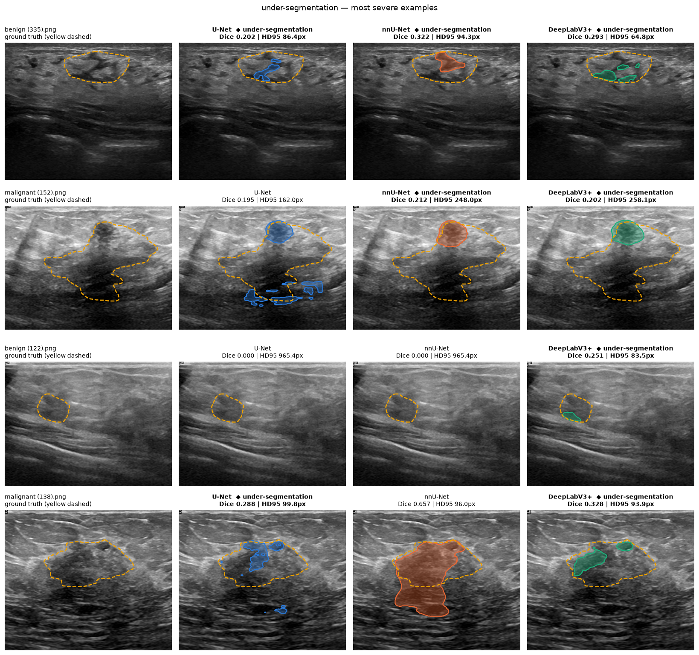
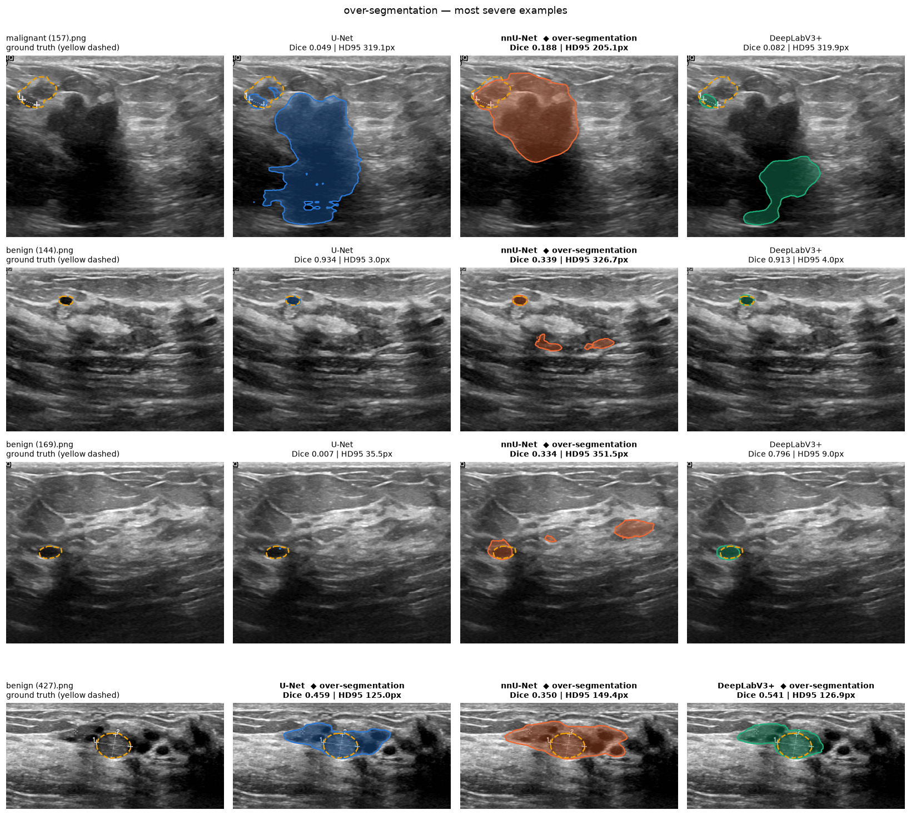
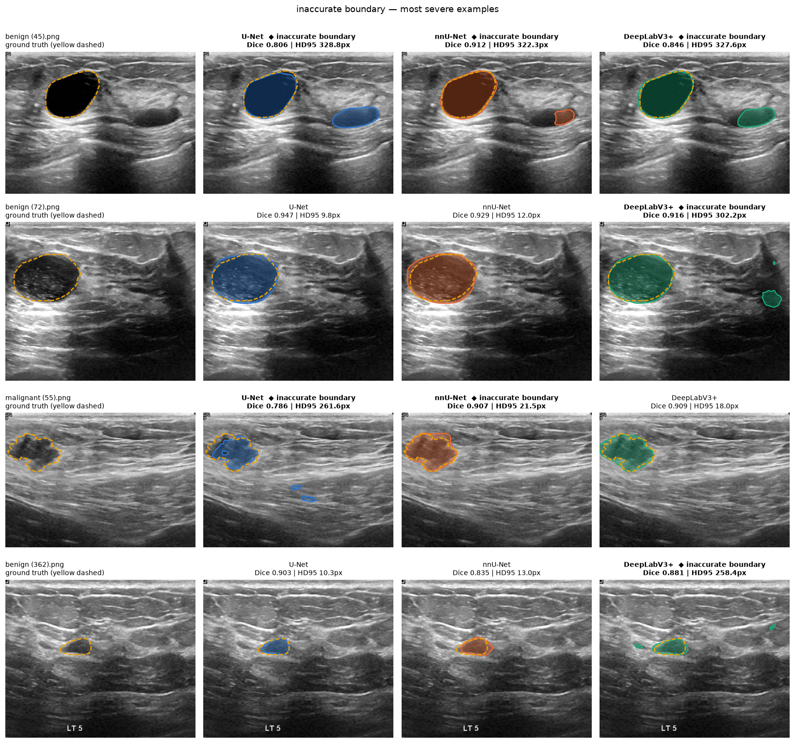

# Task 6-8: Segmentation Comparison — U-Net vs nnU-Net vs DeepLabV3+

A controlled three-way comparison of three segmentation models on BUSI breast-ultrasound
tumour segmentation: every model outputs a binary tumour mask for each of the 130 test
images, is scored with Dice, IoU and HD95, and the per-image scores are compared with
paired statistical tests. This covers Tasks 6 (training), 7 (metrics + visual comparison)
and 8 (this write-up, plus the statistics notebook).

## What image segmentation is

Classification (Tasks 1-5) gives one label per image ("benign" / "malignant").
**Segmentation gives one label per pixel**: here, whether each pixel belongs to the tumour
or to the background. The output is a binary mask with the same size as the image, so the
model must not only recognise that a lesion is present but also delineate *where* it is
and *what shape* it has. That is what clinicians need for measuring lesion size, planning
biopsies or following a tumour over time, and it is a harder task: the model is judged on
every pixel, and ultrasound boundaries are blurry, speckled and often shadowed.

Segmentation networks are usually **encoder-decoder** networks: the encoder shrinks the
image into coarse, semantically rich feature maps (*what* is there), the decoder upsamples
them back to full resolution (*where* exactly it is), and some mechanism brings fine detail
from the encoder into the decoder so that boundaries come out sharp.

## The three models

- **U-Net** (`task6_unet/`) — the classic encoder-decoder for biomedical segmentation
  (Ronneberger et al., 2015). Four down-sampling stages (64→1024 channels), four
  up-sampling stages, and **skip connections** that concatenate each encoder feature map
  with the decoder map of the same resolution, which recovers precise boundaries.
  Implemented from scratch (31.0M parameters), **trained from random initialisation**.
- **nnU-Net** (`task6_nnunet/`) — "no-new-Net" (Isensee et al., 2021): not a new
  architecture but a **self-configuring framework** around a U-Net. From a fingerprint of
  the dataset it chooses the network depth, patch size, normalisation and a fixed,
  heavily-engineered training recipe (SGD + poly LR, deep supervision, strong
  augmentation). For BUSI at 256×256 it planned a 7-stage plain-convolution U-Net with
  InstanceNorm (32→512 channels). **Trained from random initialisation.**
- **DeepLabV3+** (`task6_deeplabv3plus/`) — (Chen et al., 2018) a ResNet50 encoder with
  dilated (atrous) convolutions, an **ASPP** module that looks at the image at several
  receptive-field sizes at once, and a light decoder that fuses the ASPP output with a
  low-level encoder feature map for sharper boundaries. Built with
  `segmentation_models_pytorch` (26.7M parameters); **the encoder starts from ImageNet
  weights**.

## Experimental setup

The three notebooks share one configuration block (verbatim identical) and identical code
for loading data, merging masks, computing metrics and plotting.

| | Value |
|---|---|
| Dataset | BUSI, 647 images with tumour masks (437 benign / 210 malignant; no "normal" class in this copy) |
| Masks | `labels/<same filename>.png`, values 0/1; each image has exactly one mask file (code would OR-merge `*_mask_N` files if present); no empty masks |
| Split | fixed `train.xlsx` (517) / `test.xlsx` (130), no re-splitting, no overlap; no validation split |
| Input | grayscale, resized to **256×256** (bilinear; masks nearest-neighbour) |
| Normalisation | per-image z-score `(x − mean) / std` |
| Random seed | 42 |
| Batch size | 16 |
| Epochs | 100, one epoch = 33 iterations (ceil(517/16)) |
| Optimizer / LR | Adam, 1e-4, constant (nnU-Net: see below) |
| Loss | Dice + BCE (nnU-Net: Dice + CE) |
| Augmentation | horizontal flip (p=0.5), rotation ±15°, zoom 0.9-1.1, brightness ±0.1, contrast 0.9-1.1 (nnU-Net: see below) |
| Checkpoint | final epoch — no model selection on the test set |
| Inference | sigmoid/softmax probability at 256×256 → bilinear upsampling to the original size → threshold 0.5; no test-time augmentation, no post-processing |
| Metrics | Dice, IoU, HD95 (pixels, `medpy`) at the **original image resolution** |
| Empty prediction | Dice = IoU = 0, **HD95 = image diagonal** √(H² + W²) (worst possible distance), so every model has a value for every image and paired tests stay paired |

### Documented differences between the models

- **Pretraining** — only DeepLabV3+ starts from pretrained (ImageNet) encoder weights;
  U-Net and nnU-Net start from random weights. This is how each model is normally used,
  but it gives DeepLabV3+ a head start that is *not* due to the architecture alone. The
  grayscale input is handled by summing the RGB filters of ResNet50's first convolution,
  and the z-score replaces ImageNet mean/std normalisation.
- **nnU-Net keeps its own recipe** where replacing it would turn nnU-Net into "just another
  U-Net": SGD (Nesterov momentum 0.99, initial LR 1e-2, polynomial decay) instead of
  Adam 1e-4; deep supervision; its own augmentation pipeline (rotation, scaling, noise,
  blur, brightness, contrast, simulated low resolution, gamma, mirroring); Dice + CE loss
  on a 2-class softmax; an automatically planned network. Matched to the other two: split
  (fold `all` = all 517 training images, no internal CV), 256×256 input (patch = whole
  image), z-score normalisation, seed, batch size 16 (edited into the plans file — the
  planner had chosen 26), 100 epochs × 33 iterations (custom trainer
  `nnUNetTrainer_BUSIfair`; nnU-Net's default is 1000 × 250), final checkpoint, TTA
  disabled, and the same probability-upsampling and metric code. nnU-Net's optional
  post-processing is not applied because it is chosen by cross-validation, which fold
  `all` does not provide.
- **Normalisation layers** — U-Net uses BatchNorm, nnU-Net InstanceNorm, DeepLabV3+ the
  BatchNorm of its ResNet50 encoder.

So the comparison is between three **complete methods as they are normally used**, under a
common data pipeline, budget and evaluation protocol — not between three architectures with
everything else equal.

## Results (test set, n = 130)

Mean ± sample standard deviation over the 130 test images (`task8_statistics/descriptive_stats.csv`;
empty-prediction counts from each model's `outputs/*_test_metrics.json`).

| Model | Dice ↑ | IoU ↑ | HD95 (px) ↓ | Dice median | HD95 median (px) | Empty predictions | Training time |
|---|---|---|---|---|---|---|---|
| U-Net | 0.7301 ± 0.3108 | 0.6491 ± 0.3093 | 104.01 ± 162.88 | 0.8862 | 37.01 | 5 / 130 | 994 s |
| nnU-Net | 0.7797 ± 0.2388 | 0.6874 ± 0.2530 | 70.78 ± 114.18 | 0.8898 | 25.34 | 1 / 130 | 1028 s (+ ~18 min planning/preprocessing) |
| DeepLabV3+ | **0.7971 ± 0.2594** | **0.7185 ± 0.2642** | **64.31 ± 90.41** | **0.9060** | **18.11** | 0 / 130 | 516 s |

Each empty prediction contributes Dice = IoU = 0 and HD95 = the image diagonal (≈ 700-1000 px),
so the 5 empty U-Net predictions alone account for a large part of U-Net's HD95 mean and SD.

How to read the box plots: each dot is one test image; the box spans the middle 50% of the
images (25th-75th percentile), the thick line is the median and the whiskers reach 1.5× the box
height. The boxes of the three models largely overlap near the top, and what separates them is
the tail of low-Dice / high-HD95 failure images — longest for U-Net (dots near Dice 0 and HD95 of
600-1000 px), shortest for DeepLabV3+.

Bar height = mean over the 130 test images, error bar = ± 1 standard deviation (HD95 bars are
clipped at 0 px). A bracket with **\*** marks a pair whose difference is significant after Holm
correction under **both** the paired t-test and the Wilcoxon signed-rank test (α = 0.05): Dice,
IoU and HD95 for U-Net vs DeepLabV3+, and IoU for nnU-Net vs DeepLabV3+. Pairs without a
bracket are not significant under at least one of the two tests (see "Statistical tests" below).
The error bars overlap even for the starred pairs because the tests compare the models image by
image (paired), which removes the image-to-image spread that the SD bars show.

Failure counts and subgroups (`task8_statistics/statistical_analysis.ipynb`, section 11):

| | U-Net | nnU-Net | DeepLabV3+ |
|---|---|---|---|
| Dice = 0 | 7 | 1 | 3 |
| Dice < 0.1 (tumour essentially not found) | 15 | 4 | 7 |
| Dice < 0.5 | 23 | 18 | 16 |
| HD95 > 100 px | 42 | 27 | 26 |
| Mean Dice on the 111 images where all three reach Dice ≥ 0.1 | 0.8367 | 0.8399 | 0.8709 |
| Mean HD95 on those 111 images (px) | 61.62 | 48.01 | 45.42 |
| Mean Dice, benign (n = 91) | 0.7479 | 0.7976 | **0.8290** |
| Mean Dice, malignant (n = 39) | 0.6887 | **0.7378** | 0.7227 |
| Mean HD95, benign (px) | 100.08 | 66.20 | **50.50** |
| Mean HD95, malignant (px) | 113.17 | **81.46** | 96.51 |

## Statistical tests

Pairwise **paired t-tests** (`scipy.stats.ttest_rel`) and **Wilcoxon signed-rank tests**
(`scipy.stats.wilcoxon`) on the 130 per-image scores, with **Holm correction** of the 3
pairwise p-values within each metric and test (`statsmodels multipletests, method="holm"`),
α = 0.05. Mean diff = A − B (for Dice/IoU negative means B is better; for HD95 positive
means B is better). Full table: `task8_statistics/statistical_tests.csv`.

| Metric | Comparison (A vs B) | Mean diff | Better | t-test p | t-test p (Holm) | Sig. | Wilcoxon p | Wilcoxon p (Holm) | Sig. |
|---|---|---|---|---|---|---|---|---|---|
| Dice | U-Net vs nnU-Net | −0.0495 | nnU-Net | 0.0091 | 0.0183 | yes | 0.2366 | 0.2366 | no |
| Dice | U-Net vs DeepLabV3+ | −0.0670 | DeepLabV3+ | 0.0003 | 0.0010 | yes | <0.0001 | <0.0001 | yes |
| Dice | nnU-Net vs DeepLabV3+ | −0.0175 | DeepLabV3+ | 0.2077 | 0.2077 | no | 0.0056 | 0.0113 | yes |
| IoU | U-Net vs nnU-Net | −0.0383 | nnU-Net | 0.0341 | 0.0461 | yes | 0.3241 | 0.3241 | no |
| IoU | U-Net vs DeepLabV3+ | −0.0694 | DeepLabV3+ | <0.0001 | 0.0002 | yes | <0.0001 | 0.0002 | yes |
| IoU | nnU-Net vs DeepLabV3+ | −0.0311 | DeepLabV3+ | 0.0230 | 0.0461 | yes | 0.0025 | 0.0050 | yes |
| HD95 | U-Net vs nnU-Net | +33.22 px | nnU-Net | 0.0038 | 0.0076 | yes | 0.0501 | 0.1002 | no |
| HD95 | U-Net vs DeepLabV3+ | +39.70 px | DeepLabV3+ | 0.0023 | 0.0069 | yes | 0.0006 | 0.0018 | yes |
| HD95 | nnU-Net vs DeepLabV3+ | +6.47 px | DeepLabV3+ | 0.5036 | 0.5036 | no | 0.0650 | 0.1002 | no |

**The two tests disagree on 4 of the 9 comparisons**, and the per-image win counts
(`task8_statistics/pairwise_wins.csv`) explain why:

| Comparison | Dice: A better on / B better on | Median Dice diff | Mean Dice diff |
|---|---|---|---|
| U-Net vs nnU-Net | 68 / 61 (1 tie) | +0.0013 | −0.0495 |
| U-Net vs DeepLabV3+ | 49 / 78 (3 ties) | −0.0087 | −0.0670 |
| nnU-Net vs DeepLabV3+ | 47 / 83 | −0.0104 | −0.0175 |

- **U-Net vs nnU-Net**: on a typical image the two are tied (U-Net is even better on 68 of
  130 images, median difference ≈ 0), but U-Net fails completely far more often (15 vs 4
  images with Dice < 0.1, 5 vs 1 empty predictions). Those few large losses move the **mean**
  — the t-test sees them, the rank-based Wilcoxon test barely does. So "nnU-Net is better"
  here means "nnU-Net fails less often", not "nnU-Net segments better in general".
- **nnU-Net vs DeepLabV3+ (Dice, IoU)**: the reverse pattern. DeepLabV3+ is better on 83 of
  130 images, but by a small margin (median 0.010 Dice); a handful of images where DeepLabV3+
  fails badly while nnU-Net does not (e.g. `malignant (59)`: 0.003 vs 0.921) inflate the
  variance of the differences, so the t-test is not significant for Dice while the Wilcoxon
  test is.
- The differences are strongly non-normal (Shapiro-Wilk p < 1e-9 for every pair), with heavy
  tails from failure images, so the **Wilcoxon results are the more trustworthy of the two**
  here; the t-test answers a question about means that are dominated by a few outliers.

Robust conclusions, significant under **both** tests after Holm correction:
DeepLabV3+ > U-Net on Dice, IoU and HD95; DeepLabV3+ > nnU-Net on IoU.

## Example visualisations

All figures are in `task7_visual_comparison/figures/` (ground truth = yellow dashed contour;
U-Net blue, nnU-Net orange, DeepLabV3+ green). Every test image of every model is also shown
in the last section of each Task 6 notebook.

**Typical cases** — test images whose mean Dice over the three models is at the 75th / 50th /
25th percentile. On a typical image the main tumour outline of the three models is very
similar; the visible differences are extra blobs (DeepLabV3+ on `benign (72)`).

**Missed tumour** (recall < 0.1). `malignant (45)`: nnU-Net and DeepLabV3+ segment a darker region next
to the lesion instead of the lesion (U-Net covers about half of it, Dice 0.47, but also marks
that region); `benign (199)`: a large, flat, low-contrast lesion of which
every model finds only a small central piece; `malignant (59)`: only DeepLabV3+ misses it
(nnU-Net Dice 0.921); `benign (395)`: only U-Net misses it.

**Under-segmentation** (0.1 ≤ recall < 0.6, precision ≥ 0.8): the models find the darkest,
most clearly bounded part of a large or heterogeneous lesion (`malignant (152)`,
`malignant (138)`) and stop there; on `benign (122)`, a small low-contrast lesion, U-Net and
nnU-Net predict nothing at all (HD95 = diagonal = 965.4 px) and DeepLabV3+ covers only part of it
(Dice 0.25).

**Over-segmentation** (precision < 0.6, recall ≥ 0.8): all four most severe cases involve
nnU-Net. Either the lesion is covered but the prediction spreads into neighbouring dark tissue
(`malignant (157)`, `benign (427)`), or the small lesion is segmented correctly and extra
false-positive regions are added elsewhere (`benign (144)`, `benign (169)`; U-Net and
DeepLabV3+ get Dice 0.93 / 0.91 on `benign (144)`).

**Inaccurate boundary** (Dice ≥ 0.7 but HD95 ≥ 20 px): the most severe cases are not
jagged outlines but a **second, distant false-positive blob** next to an otherwise good
segmentation — `benign (45)`: all three also segment a second dark structure; `benign (72)`
and `benign (362)`: DeepLabV3+ adds a small far-away blob, which turns HD95 from ~10 px into
~300 px while Dice stays at 0.88-0.92.

Error counts per model over the 130 test images (`task7_visual_comparison/error_taxonomy.csv`):

| | U-Net | nnU-Net | DeepLabV3+ |
|---|---|---|---|
| empty prediction | 5 | 1 | 0 |
| missed tumour | 15 | 5 | 7 |
| under-segmentation | 13 | 7 | 6 |
| over-segmentation | 6 | 9 | 4 |
| inaccurate boundary | 34 | 45 | 40 |

## Findings

- **All three models segment most tumours well.** Median Dice is 0.886-0.906 and the
  boxes in `task8_statistics/metric_distributions.png` largely overlap; on the typical
  images the three predictions look almost the same. The differences between the models are
  concentrated in a minority of hard images.
- **DeepLabV3+ is best on average and on most images**: highest mean and median Dice / IoU,
  lowest mean and median HD95, no empty predictions, better than nnU-Net on 83/130 and than
  U-Net on 78/130 images. Its advantage over U-Net is significant under both tests on every
  metric. Part of it is very likely due to the **ImageNet-pretrained encoder** — the one
  documented difference that favours it — and it converged fastest (training loss flat
  after ~50 epochs, 516 s in total).
- **U-Net's weakness is reliability, not typical quality.** Its median Dice (0.886) equals
  nnU-Net's (0.890), but it has the most outright failures (15 images with Dice < 0.1, 5
  empty predictions), which drives its large SD (0.311) and HD95 mean (104 px). Its training
  loss was still decreasing at epoch 100 (0.268 at epoch 75 → 0.208 at epoch 100), so the
  from-scratch U-Net is probably under-trained at this budget.
- **nnU-Net fails least often but tends to over-segment.** Fewest images with Dice < 0.1
  (4) and only one empty prediction, and it is the best model on **malignant** tumours by
  mean Dice (0.738) and HD95 (81.5 px). But it has the most over-segmentation (9) and
  inaccurate-boundary (45) cases, typically extra false-positive regions. It was given only
  100 × 33 iterations (≈ 1.3% of its default 1000 × 250 schedule) and no post-processing, so
  this is not nnU-Net at full strength.
- **Malignant tumours are harder for every model** (mean Dice 0.69-0.74 vs 0.75-0.83 for
  benign): irregular, spiculated outlines and heterogeneous echo texture make the boundary
  ambiguous, and large malignant lesions are often only partly segmented.
- **Dice/IoU and HD95 measure different things.** IoU = Dice / (2 − Dice) held to machine
  precision on every image, so IoU adds no new ranking information. HD95 does: a single small
  false-positive blob far from the tumour leaves Dice almost unchanged but adds hundreds of
  pixels of HD95 (`benign (72)`: DeepLabV3+ Dice 0.916, HD95 302 px). The most severe
  "inaccurate boundary" cases are all of this kind, and the flagged cases keep a high median
  precision (0.89-0.94), which fits small extra regions better than broadly misplaced outlines.
- **The choice of statistical test changes the conclusion for 4 of 9 comparisons.** Because
  the per-image differences are heavy-tailed (failure images), the paired t-test and the
  Wilcoxon test answer different questions ("is the mean different?" vs "is one model better
  on most images?") and disagree; only the comparisons significant under both should be
  reported as firm differences.

## Conclusion

Under one shared data pipeline, training budget and evaluation protocol, **DeepLabV3+ with an
ImageNet-pretrained ResNet50 encoder is the strongest of the three methods on BUSI**: mean
Dice 0.797, IoU 0.719, HD95 64.3 px, and significantly better than U-Net on all three metrics
and than nnU-Net on IoU under both the paired t-test and the Wilcoxon test (Holm-corrected).
**nnU-Net and U-Net are tied on a typical image**; nnU-Net's significant lead in the t-test
comes from U-Net failing completely on more images, and it does not survive the Wilcoxon
test. Two caveats limit how far this ranking generalises: the comparison is between complete
methods (DeepLabV3+'s pretraining and nnU-Net's own recipe are part of what is compared, and
nnU-Net ran at ~1% of its default training length), and all numbers come from **one split
and one seed** — the tests capture variability across test images, not across retraining.
Natural next steps would be to retrain each model with several seeds, give U-Net and
nnU-Net a longer schedule, and apply connected-component post-processing (keep the largest
component), which directly targets the distant false positives that dominate the HD95 errors.

## Where to look for more detail

- Training, prediction and per-image figures: `task6_unet/U_Net_segmentation.ipynb`,
  `task6_nnunet/nnU_Net_segmentation.ipynb`, `task6_deeplabv3plus/DeepLabV3Plus_segmentation.ipynb`;
  per-image scores in each folder's `per_image_metrics.csv`, masks in `predictions/`.
- Weights: `task6_unet/outputs/unet_final.pt`, `task6_deeplabv3plus/outputs/deeplabv3plus_final.pt`,
  `task6_nnunet/nnUNet_results/Dataset501_BUSI/nnUNetTrainer_BUSIfair__nnUNetPlans__2d/fold_all/checkpoint_final.pth`.
- Metric explanation, error taxonomy and side-by-side figures:
  `task7_visual_comparison/visual_comparison.ipynb`, `figures/`, `error_taxonomy.csv`.
- Statistics: `task8_statistics/statistical_analysis.ipynb`, `statistical_tests.csv`, `mean_comparison.png`.
