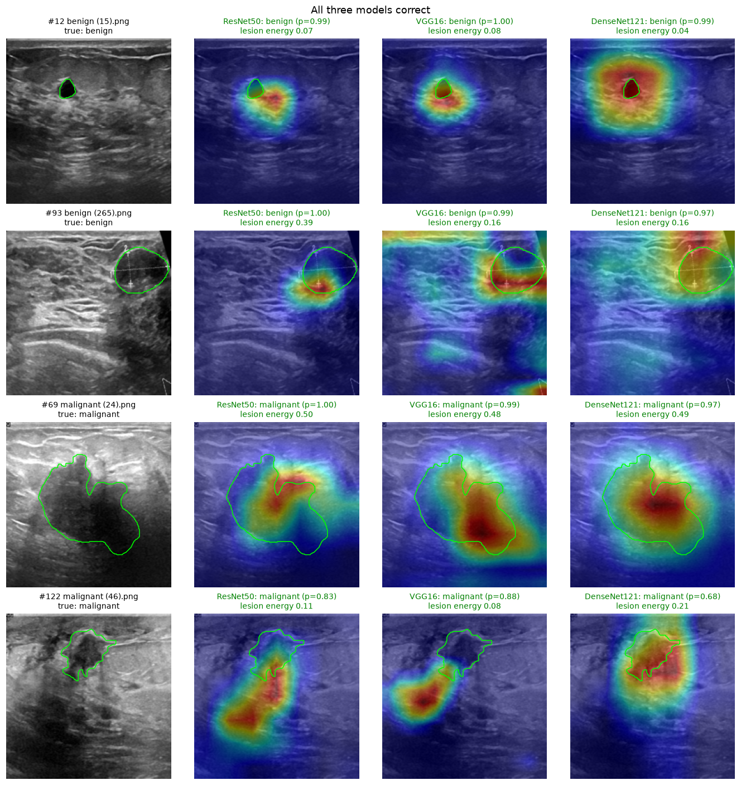
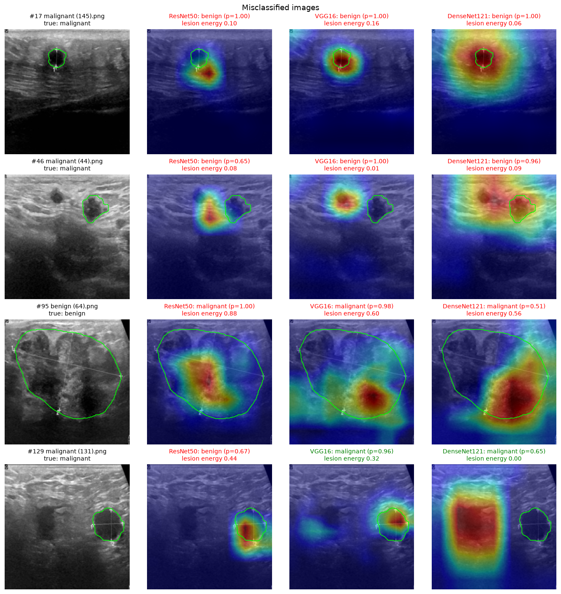

# Task 5: Grad-CAM Comparison of ResNet50, VGG16 and DenseNet121

This task looks at *where* each of the three Task 2 models looks when it classifies a
test image, not just whether its answer is right. The three checkpoints are the
fair-comparison models from `task2_resnet_baseline/`, `task2_vgg16/` and
`task2_densenet121/`. They were loaded as-is, with no retraining.

- Notebook: `task5_cam/GradCAM_comparison.ipynb`. Run it with `sbatch run_task5_cam.slurm`
  from inside `task5_cam/`. It only runs inference and takes a few minutes on one GPU.
- CAM figures for every one of the 130 test images, per model: `resnet50/`, `vgg16/`,
  `densenet121/`. Each file is named `<idx>_<image>_true-<cls>_pred-<cls>_<OK|WRONG>.jpg`.
- Per-image numbers: `<model>/cam_stats.csv`. Aggregated numbers: `cam_summary.json`.
- Side-by-side figures: `comparison_all_correct.png`, `comparison_wrong.png`,
  `mean_cam_per_model.png`.

## Method

**Grad-CAM, not classic CAM.** Classic CAM reads the per-channel weights straight off the
final Linear layer, so the model's head must be "global average pooling followed by one
Linear layer". ResNet50 and DenseNet121 have that head. VGG16 has three stacked
fully-connected layers after a flatten, so classic CAM does not apply to it. Grad-CAM
replaces the Linear weights with the gradient of the target class score with respect to
the last convolutional feature map, averaged over spatial positions. For a GAP + Linear
head this gives exactly the classic CAM, and it works on any CNN without changing the
model. All three models are therefore explained with the same method.

- **Target class:** the class the model predicted. The map answers the question "which
  region drove this model to this answer", for right and wrong answers alike.
- **Target layer:** the last convolutional feature map before the classifier.
  - ResNet50: `layer4`, 7×7.
  - VGG16: `features[29]`, the ReLU after the last conv layer, 14×14.
  - DenseNet121: `relu(features(x))`, 7×7.
- **Correctness checks:** the notebook confirms that the split forward pass reproduces
  each model's own logits exactly (max difference 0). It also confirms the accuracies
  match Task 2: 0.9000, 0.8615 and 0.9000.

**Objective check with lesion masks.** BUSI provides a hand-drawn lesion mask for every
image in `~/datasets/BUSI/labels/`. The masks were never used in training. Here they
serve only as a ruler for measuring each CAM, so the observations below do not rest on
eyeballing alone. The notebook computes these measures:

| Measure | Definition | Uniform-map (chance) level |
|---|---|---|
| `lesion_energy` | share of total CAM activation that falls inside the lesion mask | = lesion area, which averages 0.097 on this test set |
| `peak_in_lesion` | the hottest CAM pixel lies inside the lesion (the "pointing game") | = lesion area |
| `border_energy` | share of CAM in the outer 10% band of the frame, where the black margins, skin line, calipers and scanner text sit | 0.354 |
| `hot_area` | share of the image where CAM > 0.5, a measure of how spread out the map is | - |

## Quantitative summary (all 130 test images)

| Model | lesion_energy | lesion_energy / lesion area (median) | peak_in_lesion | border_energy | hot_area |
|---|---|---|---|---|---|
| ResNet50 | **0.274** | **3.5×** | 0.385 | **0.047** | 0.060 |
| VGG16 | 0.191 | 2.1× | 0.354 | 0.261 | 0.070 |
| DenseNet121 | 0.195 | 2.6× | **0.508** | 0.208 | 0.213 |

Split by whether the prediction was correct. The "wrong" groups are small: n = 13, 18 and 13.

| Model | lesion_energy (correct / wrong) | peak_in_lesion (correct / wrong) | border_energy (correct / wrong) |
|---|---|---|---|
| ResNet50 | 0.270 / 0.304 | 0.385 / 0.385 | 0.042 / 0.086 |
| VGG16 | 0.199 / 0.147 | 0.366 / 0.278 | 0.257 / 0.282 |
| DenseNet121 | 0.195 / 0.201 | 0.504 / 0.538 | 0.202 / 0.262 |

Other counts from `cam_stats.csv`:

- **Images where the CAM misses the lesion** (lesion_energy below chance *and* the peak
  outside the lesion):
  - ResNet50: 12/130, of which 2 are among its 13 wrong predictions.
  - VGG16: 35/130, of which 10 are among its 18 wrong predictions.
  - DenseNet121: 9/130, of which 1 is among its 13 wrong predictions.
- **Images with more than half the CAM in the border band:** VGG16 12, ResNet50 0,
  DenseNet121 0.
- **Agreement between models:** the mean per-image correlation between two models' maps
  is 0.43 for ResNet50 vs VGG16, 0.50 for ResNet50 vs DenseNet121, and 0.40 for VGG16 vs
  DenseNet121. The models look at broadly overlapping regions, but far from identical ones.

## Representative images

The selection is rule-based, with seed 42, and was not picked by looking at the maps:

- 4 images that all three models get right: 2 benign and 2 malignant, drawn at random.
- 3 images drawn at random from the 6 that all three models get wrong.
- 1 image drawn at random from the 22 images the models disagree on.

The green outline is the ground-truth lesion.

### All three models correct (`comparison_all_correct.png`)

- **#12 benign (15):** a very small, dark, round lesion. All three maps sit on or right
  next to it.
  - VGG16's hot spot is centred on the lesion.
  - ResNet50's peak is just below and to the right of the lesion, on the adjacent tissue.
  - DenseNet121 produces one large blob that covers the lesion and a wide margin around it.
  - The lesion_energy values are low for all three (0.04–0.08), but only because the
    lesion is tiny. None of the models is looking somewhere unrelated.
- **#93 benign (265):** a large oval lesion at the right edge of the frame, with caliper
  marks.
  - ResNet50 is compact, on the lower half of the lesion (0.39).
  - VGG16 lights up the lower edge of the lesion, but also a band along the top edge of
    the image and the bottom-right corner, which are not tissue of interest.
  - DenseNet121's strongest activation is in the top-right corner, which includes the
    dark wedge outside the scan area, with weaker activation over the lesion.
  - All three predicted correctly, yet VGG16 and DenseNet121 partly rely on regions at
    the frame boundary.
- **#69 malignant (24):** a large, irregular dark mass. All three maps are clearly on the
  mass, with lesion_energy of about 0.5 each. They concentrate on different parts of it:
  ResNet50 on the upper notch, VGG16 on the lower lobe, DenseNet121 on the centre.
- **#122 malignant (46):** an irregular mass in the upper-middle of the image.
  - DenseNet121's map covers the mass (0.21).
  - ResNet50 and VGG16 are hottest on the dark region *below* and to the lower left of
    the mass, with lesion_energy of 0.11 and 0.08. That region may be posterior acoustic
    shadowing behind the mass, a known malignancy sign in ultrasound, or it may be
    unrelated dark tissue. The CAM alone cannot tell the two apart. What the CAM does show
    is that for these two models the evidence came mostly from outside the annotated mass.

### Misclassified images (`comparison_wrong.png`)

- **#17 malignant (145):** all three models predict benign with p = 1.00. All three maps
  sit on or right beside the small lesion; VGG16 is centred on it. The models are *not*
  looking at the wrong place. They look at the right place and draw the wrong conclusion.
  In the image the lesion is small, round and fairly well circumscribed, which is a
  benign-like appearance.
- **#46 malignant (44):** all three predict benign. There are two dark round structures
  in the image, and the annotated lesion is the right-hand one.
  - VGG16 is centred on the *other*, unannotated dark structure to its left
    (lesion_energy 0.01).
  - ResNet50's peak lies between the two, closer to the left one (0.08).
  - DenseNet121's blob spans both but peaks on the left one (0.09).
  - This is the clearest case among the picks of all three models attending to the wrong
    structure. The distractor is real tissue, not an edge or an artifact.
- **#95 benign (64):** all three predict malignant.
  - The maps lie mostly *inside* the large, lobulated, heterogeneous lesion: ResNet50
    0.88, VGG16 0.60, DenseNet121 0.56.
  - VGG16 also puts some activation along the bottom edge of the frame.
  - Location is again not the problem; the lesion's irregular, heterogeneous appearance
    looks malignant to all three.
- **#129 malignant (131):** the models disagree.
  - ResNet50 is wrong (benign, p = 0.67), although its map sits squarely on the lesion (0.44).
  - VGG16 is right and also on the lesion (0.32).
  - DenseNet121 is right (p = 0.65) but its map is on the dark rectangular region to the
    *left* of the lesion and has zero overlap with it (0.00). This is a correct answer
    for a reason that has nothing to do with the annotated lesion.

### Edge activations outside the eight picks

VGG16 has the highest border_energy of any model, at 0.65–0.67 on its top four images.
All four are *correct* benign predictions: benign (411), (381), (364) and (108). Their
lesion_energy is 0.01–0.25, and their confidences are on the low side (p = 0.51–0.89). In
the figures for (381), (364) and (108) under `vgg16/`, the map sits on the bright skin line
along the top of the frame, on a marker in the top-left corner, or on the bottom edge,
while the lesion is almost dark.

DenseNet121's highest-border image, malignant (45), is wrong: it predicts benign, and the
CAM sits in the top-left corner, above and away from the lesion.

## Answers to the three questions

**1. Do the models attend to the lesion, or to irrelevant background?**

Mostly the lesion region, but to a degree that differs by model, and none of them does it
reliably.

- On average all three put about 2–3.5× more activation on the lesion than a uniform map
  would.
- ResNet50 is the most lesion-focused by lesion_energy (0.27, median 3.5× chance). It
  almost never uses the frame border (0.047, far below the 0.354 uniform level).
- DenseNet121's single hottest point lands in the lesion most often (51%). Its maps are
  so broad, though (hot_area 0.21, about 3× the other two), that a large share of the
  activation still spreads over surrounding tissue.
- VGG16 attends to background most often. It misses the lesion on 35/130 images, and on
  12 images most of its map sits on the frame border: the skin line, corner markers and
  bottom edge.
- For ResNet50 and VGG16 about 62–65% of the hottest points fall *outside* the lesion
  outline; for DenseNet121 it is 49%.
  Many of these are adjacent to the lesion rather than far away (#12, #17, #122), and
  benign lesions are small (7% of the image on average), which makes an exact hit hard
  at 7×7 or 14×14 resolution.

**2. On misclassified images, did the CAM show the model looking in the wrong place?**

Sometimes, but it is *not* the dominant failure mode, and edges/artifacts are not the main
explanation for errors.

- For ResNet50 and DenseNet121, wrong predictions have the same or even higher
  lesion_energy than correct ones (0.30 vs 0.27 and 0.20 vs 0.20). Only 2/13 and 1/13 of
  their errors come with a map that misses the lesion.
- Most of their errors look like #17 and #95: the model attends to the lesion and
  misjudges its appearance. A small, round malignant lesion is called benign; a large,
  lobulated benign lesion is called malignant.
- VGG16 is the exception. Its wrong predictions do have lower lesion_energy (0.15 vs
  0.20) and lower peak_in_lesion (0.28 vs 0.37), and 10 of its 18 errors come with a map
  that misses the lesion. VGG16's extra errors are therefore partly explained by looking
  elsewhere.
- The clearest "wrong place" case is #46, where all three were drawn to a second,
  unannotated dark structure. That structure is real tissue, not an edge artifact.
- Border activations do occur. Border energy is somewhat higher on wrong predictions
  (0.086 vs 0.042 for ResNet50, 0.26 vs 0.20 for DenseNet121). But VGG16's
  strongest edge-focused maps all come with *correct* predictions. Attending to the
  frame edge is a general VGG16 habit, not something that shows up only when it errs.

**3. Are there visible differences between residual, plain-stacked and densely connected architectures?**

Yes, and they are consistent across the 130 images.

- **ResNet50 (residual):**
  - compact, single-peak maps (hot_area 0.06);
  - almost nothing on the image border;
  - its average map (`mean_cam_per_model.png`) is a tight spot in the upper-central
    region, where lesions usually are (compare with the mean lesion mask).
- **VGG16 (plain conv stack):**
  - small hot spots, but the location varies more from image to image, so its average
    map is flat;
  - it is the only model whose average map shows faint structure along the top-left
    corner and the bottom edge;
  - it often has secondary blobs on the skin line and frame corners;
  - its 14×14 feature map makes its heatmaps finer-grained than the 7×7 maps of the other
    two. That is a resolution effect, not an attention difference, so the "sharpness" of
    VGG16's maps should not be read as better localisation.
- **DenseNet121 (dense connectivity):**
  - large, smooth blobs that often cover the lesion *plus* a wide margin, sometimes the
    whole upper half of the frame;
  - its average map is a broad upper-central blob, the brightest of the three;
  - this broadness is why its peak_in_lesion is the highest while its lesion_energy is
    not;
  - it also occasionally locks onto an unrelated dark region with full confidence
    (#129, malignant (45)).

The two 7×7 models agree with each other more (map correlation 0.50) than either agrees
with VGG16 (0.43 and 0.40).

We cannot claim from this experiment that residual or dense connections *cause* these
patterns. The three models also differ in depth, pretraining weights and head structure,
and each was trained only once. What we can say is that, under the same training recipe,
these are the attention patterns each trained model shows.

## Caveats

- **Resolution.** Grad-CAM resolution is fixed by each architecture's last conv layer:
  7×7 for ResNet50 and DenseNet121, 14×14 for VGG16. Fine detail within a lesion cannot
  be resolved.
- **What the mask measures.** The lesion mask marks the lesion, not all diagnostically
  relevant tissue. A malignant lesion's shadowing or the surrounding margin can be
  legitimate evidence, so a low lesion_energy does not automatically mean the model was
  wrong to look there (see #122).
- **Sample sizes.** There are 13–18 wrong predictions per model. The correct-vs-wrong
  differences above are descriptive, not statistically tested.
- **One seed per model.** Each model was trained once. A different seed could shift the
  individual maps.
